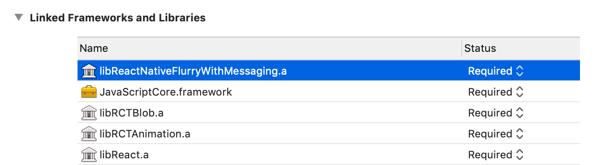
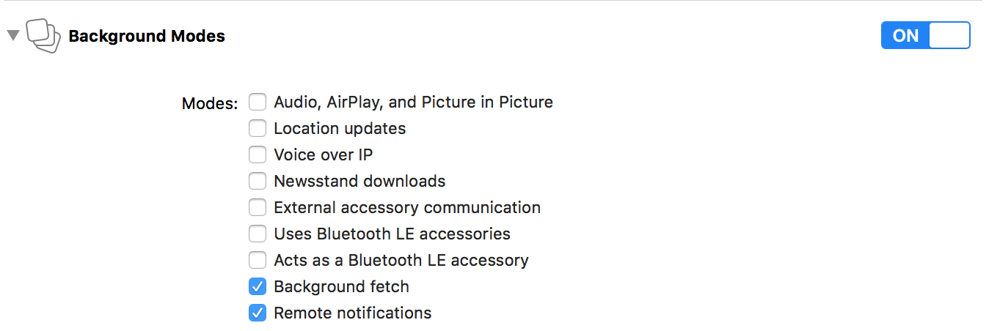
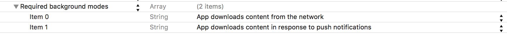

# React Native Flurry SDK (react-native-flurry-sdk)

[](https://www.npmjs.com/package/react-native-flurry-sdk)

[](https://www.npmjs.com/package/react-native-flurry-sdk)

A React Native plugin for Flurry SDK

**Flurry Push** for messaging and **Flurry Config** for remote configuration are now supported by our plugin!

## Table of contents

- [Installation](#installation)
  - [Android](#android)
  - [iOS](#ios)
  - [tvOS](#tvos)
- [Example](#example)
- [API Reference](#api-reference)
- [Support](#support)
- [License](#license)

## Installation

1. Install Flurry SDK module by `npm`

   ```bash
   npm install react-native-flurry-sdk --save
   ```

2. If you are using React Native >= 0.60, install CocoaPods dependency

   ```bash
   cd ios && pod install && cd ..
   ```

   If you are using React Native < 0.60, link React Native dependency

   ```bash
   react-native link react-native-flurry-sdk
   ```

3. Add Flurry JS code

   ```javascript
   import Flurry from 'react-native-flurry-sdk';
   ```

### Android

- By default, Flurry adds `INTERNET` and `ACCESS_NETWORK_STATE` permissions to optimize analytics data. Please see [Manual Flurry Android SDK Integration](https://developer.yahoo.com/flurry/docs/integrateflurry/android-manual/) for the other recommended options.
- To improve analytics identities, please see [Manual Flurry Android SDK Integration](https://developer.yahoo.com/flurry/docs/integrateflurry/android-manual/) for adding Google Play Services library in your app by including the following in your `build.gradle` file:

  ```groovy
  dependencies {
      // Recommended to add Google Play Services
      implementation 'com.google.android.gms:play-services-base:15.0.1'
      implementation 'com.google.android.gms:play-services-ads:15.0.1'
  }
  ```

- **Flurry Push**</br>
  In order to use [Flurry Push](https://developer.yahoo.com/flurry/docs/push/) for [Android](https://developer.yahoo.com/flurry/docs/push/integration/android/), please follow the additional steps below:
  1. Flurry Push requires your projects to initialize Flurry from your Application class. Please do the Flurry setup in `MainApplication.onCreate()`. With the same APIs as the JavaScript version.

     ```java
       new FlurryModule.Builder()
            .withCrashReporting(true)
            .withLogEnabled(true)
            .withLogLevel(Log.VERBOSE)
            .withMessaging(true, options_or_listener) // optional user's native `FlurryMarketingOptions` or `FlurryMessagingListener`.
            .build(this, FLURRY_ANDROID_API_KEY);
     ```

  2. Follow [Set up a Firebase Cloud Messaging client app on Android](https://firebase.google.com/docs/cloud-messaging/android/client). Complete "Set up Firebase and the FCM SDK" step for adding Firebase to your Android project. There should be a file `google-services.json` in your project's `android/app` folder now. You do not need to provide any setup codes here. Your `build.gradle` will look like:

     ```groovy
        // android/build.gradle (project-level)
        buildscript {
            dependencies {
                classpath 'com.google.gms:google-services:4.0.1'
            }
        }
     ```

     ```groovy
        // android/app/build.gradle
        apply plugin: 'com.google.gms.google-services'

        dependencies {
            implementation 'com.google.firebase:firebase-core:16.0.3'
            implementation 'com.google.firebase:firebase-messaging:17.3.2'
        }
     ```

  3. Set up "Android Authorization" in Flurry [Push Authorization](https://developer.yahoo.com/flurry/docs/push/authorization/).

### iOS

- Please note that starting from [React Native 0.60](https://facebook.github.io/react-native/blog/2019/07/03/version-60), [CocoaPods](https://cocoapods.org) is now the default integration approach for React Native iOS projects. If you are not using CocoaPods, please stick to `react-native-flurry-sdk@3.7.0`.

- **Flurry Push**</br>
  To set up Flurry Push, please take the following steps.
  1. Open your Podfile, which is located under `ios` folder of your project.
  2. Add the following line in your target section before `use_native_modules!`
     
     ```ruby
     pod 'react-native-flurry-sdk', :path => '../node_modules/react-native-flurry-sdk/ios', :subspecs => ['FlurrySDK-Push']
     ```
     
     Your target section of Podfile should now look like this:

     ```ruby
     target 'YourTarget' do

       # Pods for your target
       pod 'React', :path => '../node_modules/react-native/'
       pod 'React-Core', :path => '../node_modules/react-native/React'
       # ... other React dependencies
       
       # Add react-native-flurry-sdk
       pod 'react-native-flurry-sdk', :path => '../node_modules/react-native-flurry-sdk/ios', :subspecs => ['FlurrySDK-Push']
       
       # ... other targets
       target 'YourTargetTests' do
         # ...
       end

       use_native_modules!

     end
     ```
  3. Install the dependencies again by executing

     ```bash
     cd ios && pod install && cd ..
     ```

  4. Open your `.xcworkspace` file which is under the `ios` folder. Go to "Capabilities" tab and enable Push Notifications.
     
  5. Enable Background Modes (Background Fetch and Remote Notifications turned on).
     
     Now your `Info.plist` should contain the following items. For more information, please see [Push Setup](https://developer.yahoo.com/flurry/docs/push/integration/ios/).
     
  6. Set up "iOS Authorization" in Flurry [Push Authorization](https://developer.yahoo.com/flurry/docs/push/authorization/).
  7. In order to handle notifications from a cold start, Flurry Push requires to be initialized from AppDelegate as early as possible. Please open `AppDelegate.m`, import the header file

     ```objc
     #import "ReactNativeFlurry.h"
     ```

     And add this line right after `- (BOOL)application:(UIApplication *)application didFinishLaunchingWithOptions:(NSDictionary *)launchOptions`

     ```objc
     [ReactNativeFlurry enableMessaging];
     ```

### tvOS

- Please note that Flurry Messaging and Flurry Config are currently not available on tvOS. For the detailed list of unavailable APIs, please see API reference below.

## Example

- `index.js`

   ```javascript
   import { AppRegistry } from 'react-native';
   import { name as appName } from './app.json';
   import App from './App';
   import Flurry from 'react-native-flurry-sdk';
  
   // Init Flurry once as early as possible recommended in index.js.
   // For each platfrom (Android, iOS) where the app runs you need to acquire a unique Flurry API Key.
   // i.e., you need two API keys if you are going to release the app on both Android and iOS platforms.
   // If you are building for TV platforms, you will need two API keys for Android TV and tvOS.
   new Flurry.Builder()
     .withCrashReporting(true)
     .withLogEnabled(true)
     .withLogLevel(Flurry.LogLevel.DEBUG)
     .build(FLURRY_ANDROID_API_KEY, FLURRY_IOS_API_KEY);
  
   AppRegistry.registerComponent(appName, () => App);
   ```

- `App.js`

   ```javascript
   import React, { Component } from 'react';
   import {
     Platform,
     StyleSheet,
     Text,
     View
   } from 'react-native';
   import Flurry from 'react-native-flurry-sdk';
  
   type Props = {};
   export default class App extends Component<Props> {
     constructor(props) {
       super(props);
  
       // Example to get Flurry versions.
       Flurry.getVersions().then((versions) => {
         console.log('Versions: ' + versions.agentVersion + ' : ' + versions.releaseVersion + ' : ' + versions.sessionId);
       });
     }
  
     render() {
       // Set users preferences.
       Flurry.setAge(36);
       Flurry.setGender(Flurry.Gender.FEMALE);
       Flurry.setReportLocation(true);
  
       // Log Flurry events.
       Flurry.logEvent('React Native Event');
       Flurry.logEvent('React Native Timed Event', {param: 'true'}, true);
       ...
       Flurry.endTimedEvent('React Native Timed Event');
  
       return (
         <View style={styles.container}>
           ...
         </View>
       );
     }
   }
   ...
   ```

- `index.js / Config.js`

   ```javascript
   Flurry.addConfigListener((event) => {
     if (event.Type === Flurry.ConfigStatus.SUCCESS) {
       // Data fetched, activate it.
       Flurry.activateConfig();
     } else if (event.Type === Flurry.ConfigStatus.ACTIVATED) {
       // Received cached data, or newly activated data.
       Flurry.getConfigString('welcome_message', 'Welcome!').then((value) => {
         console.log((event.isCache ? 'Received cached data: ' : 'Received newly activated data: ') + value.welcome_message);
       });
     } else if (event.Type === Flurry.ConfigStatus.UNCHANGED) {
       // Fetch finished, but data unchanged.
       Flurry.getConfigString('welcome_message', 'Welcome!').then((value) => {
         console.log('Received unchanged data: ' + value.welcome_message);
       });
     } else if (event.Type === Flurry.ConfigStatus.ERROR) {
       // Fetch failed.
       console.log('Fetch error! Retrying: ' + event.isRetrying);
     }
   });

   Flurry.fetchConfig();
   ```

- `index.js / Messaging.js`

   ```javascript
   // To enable Flurry Push for Android, please duplicate Builder setup in your MainApplication.java.
   new Flurry.Builder()
     .withMessaging(true)
     ...
  
   // Optionally add a listener to receive messaging events, and handle the notification.
   // Please call required Flurry.willHandleMessage(boolean) when received event types of
   // MessageType.RECEIVED or MessageType.CLICKED as soon as possible to avoid delay.
   Flurry.addMessagingListener((message) => {
     if (message.Type === Flurry.MessageType.RECEIVED) {
       Flurry.willHandleMessage(false);
     } else if (message.Type === Flurry.MessageType.CLICKED) {
       Flurry.willHandleMessage(false);
     }
  
     Flurry.printMessage(message);
   });
   ```

## API Reference

See [Android](http://flurry.github.io/flurry-android-sdk/)-[(FlurryAgent)](http://flurry.github.io/flurry-android-sdk/com/flurry/android/FlurryAgent.html) /
[iOS](http://flurry.github.io/flurry-ios-sdk/)-[(Flurry)](http://flurry.github.io/flurry-ios-sdk/interface_flurry.html) for the Flurry references.

- **Methods to initialize Flurry**

  ```javascript
  Flurry.Builder.withAppVersion(versionName = '1.0'); // iOS only. For Android, please use Flurry.setVersionName() instead.
  Flurry.Builder.withCrashReporting(crashReporting = true);
  Flurry.Builder.withContinueSessionMillis(sessionMillis = 10000);
  Flurry.Builder.withIAPReportingEnabled(enableIAP = true); // iOS only.
  Flurry.Builder.withIncludeBackgroundSessionsInMetrics(includeBackgroundSessionsInMetrics = true);
  Flurry.Builder.withLogEnabled(enableLog = true);
  Flurry.Builder.withLogLevel(logLevel = Flurry.LogLevel.WARN); // LogLevel = { VERBOSE, DEBUG, INFO, WARN, ERROR, ASSERT }
  Flurry.Builder.withMessaging(enableMessaging = true); // not available on tvOS
  
  Flurry.Builder.build(apiKeyAndroid: string, apiKeyIos: string);  // preferred; passing null if not available
  Flurry.Builder.build(apiKey: string);  // use when only single platform is supported, or shared (not recommended)
  
  // tvOS only
  Flurry.Builder.withTVSessionReportingInterval(interval = 5);
  Flurry.Builder.withTVEventCountThreshold(threshold = 10);
  ```

- **Methods must be called prior to invoking init** *(Deprecated, please use Flurry.Builder instead)*

  ```javascript
  Flurry.withCrashReporting(crashReporting = true);
  Flurry.withContinueSessionMillis(sessionMillis = 10000);
  Flurry.withIncludeBackgroundSessionsInMetrics(includeBackgroundSessionsInMetrics = true);
  Flurry.withLogEnabled(enableLog = true);
  Flurry.withLogLevel(logLevel = Flurry.LogLevel.WARN); // LogLevel = { VERBOSE, DEBUG, INFO, WARN, ERROR, ASSERT }
  ```

  ```javascript
  Flurry.init(apiKeyAndroid: string, apiKeyIos: string);  // preferred; passing null if not available
  Flurry.init(apiKey: string);  // use when only single platform is supported, or shared (not recommended)
  ```

- **Methods to set users preferences**

  ```javascript
  Flurry.setAge(age: number);
  Flurry.setGender(gender: Flurry.Gender); // Gender = { MALE, FEMALE }
  Flurry.setReportLocation(reportLocation: boolean);
  Flurry.setSessionOrigin(originName: string, deepLink: string);
  Flurry.setUserId(userId: string);
  Flurry.setVersionName(versionName: string); // Android only. For iOS, please use Flurry.Builder.withAppVersion() instead.
  
  Flurry.addOrigin(originName: string, originVersion: string);
  Flurry.addOrigin(originName: string, originVersion: string, originParameters: { [key: string]: string; });
  Flurry.addSessionProperty(name: string, value: string);
  ```

- **Methods to get Flurry versions**

  ```javascript
  Flurry.getVersions(): Promise<{ agentVersion: number; releaseVersion: string; sessionId: string; }>;
  Flurry.getVersions(errorCallback: (errorMessage: string) => void,
                     successCallback: (agentVersion: number, releaseVersion: string, sessionId: string) => void);
  ```

- **Methods to log Flurry events**

  ```javascript
  Flurry.logEvent(eventId: string);
  Flurry.logEvent(eventId: string, timed: boolean);
  Flurry.logEvent(eventId: string, parameters: { [key: string]: string; });
  Flurry.logEvent(eventId: string, parameters: { [key: string]: string; }, timed: boolean);
  
  Flurry.endTimedEvent(eventId: string);
  Flurry.endTimedEvent(eventId: string, parameters: { [key: string]: string; });
  
  Flurry.onPageView(); // Deprecated, API removed, no longer supported by Flurry.
  
  Flurry.onError(errorId: string, message: string, errorClass: string);
  Flurry.onError(errorId: string, message: string, errorClass: string, errorParams: { [key: string]: string; });
  
  Flurry.logBreadcrumb(crashBreadcrumb: string);
  Flurry.logPayment(productName: string, productId: string, quantity: number, price: number,
                    currency: string, transactionId: string, parameters: { [key: string]: string; });
  ```

- **Methods to enable IAP reporting (iOS and tvOS)**

  ```javascript
  Flurry.setIAPReportingEnabled(enableIAP: boolean);
  ```

- **Methods for Flurry Config**

  ```javascript
  // Event.Type:       Flurry.ConfigStatus = { SUCCESS, UNCHANGED, ERROR, ACTIVATED }
  // Event.isRetrying: true if it is still retrying fetching, for ERROR type
  // Event.isCache:    true if activated from the cached data, for ACTIVATED type
  Flurry.addConfigListener   (callback: (event: { Type: string; isCache?: boolean; isRetrying?: boolean; }) => void);
  Flurry.removeConfigListener(callback: (event: { Type: string; isCache?: boolean; isRetrying?: boolean; }) => void);
  Flurry.fetchConfig();
  Flurry.activateConfig():
  Flurry.getConfigString(key: string, defaultValue: string):         Promise<{ [key: string]: string; }>;
  Flurry.getConfigString(keyAndDefault: { [key: string]: string; }): Promise<{ [key: string]: string; }>;
  ```

- **Methods for Messaging (Flurry Push)**

  ```javascript
  // Message.Type: Flurry.MessageType = { RECEIVED,  CLICKED,
  //                                      CANCELLED, REFRESH } (Android only)
  // Message.Title:       message title
  // Message.Body:        message body
  // Message.Data:        message data (Map)
  // Message.ClickAction: click action (Android only)
  // Message.Token:       refreshed token
  Flurry.addMessagingListener(callback: (message: { Type: string;
                    Title?: string; Body?: string; Data?: { [key: string]: string; }; ClickAction?: string;
                    Token?: string; }) => void);
  Flurry.removeMessagingListener(callback: (message: { Type: string;
                    Title?: string; Body?: string; Data?: { [key: string]: string; }; ClickAction?: string;
                    Token?: string; }) => void);
  Flurry.willHandleMessage(handled: boolean);
  Flurry.printMessage(message: { Type: string;
                    Title?: string; Body?: string; Data?: { [key: string]: string; }; ClickAction?: string;
                    Token?: string; });
  ```

## Support

- [Flurry Developer Support Site](https://developer.yahoo.com/flurry/docs/)

## License

Copyright 2018 Oath Inc.

This project is licensed under the terms of the [Apache 2.0](http://www.apache.org/licenses/LICENSE-2.0) open source license. Please refer to [LICENSE](LICENSE) for the full terms.
